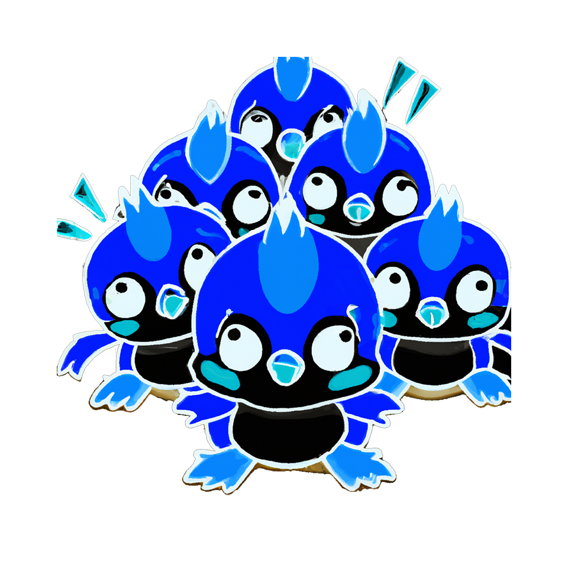

Ṣ̸͆̓͜T̶̺̏͝Ớ̸̠̬P̴̛̝͓̋ ̸̱̻̑͂I̴̩̙͐͋T̴̯́.̸̥͊͘ ̵̟̺̂  
̶̛̤͓͝S̴̨̮̅̊T̷̳̓̐O̴̠̿͝P̴̗͎̿ ̴̢̏̚R̴͓̍͝E̷̝̺̿͛F̵͓̈́Ȓ̵̖͑E̸̺͒̃S̸̢̈̽͜H̵̝͆͠I̶̡̔N̴̟͙̿G̵͈̬̈́ ̴̘̹̃M̵͉͈̚Ȇ̷͙͌.̸̎ͅ ̷̟̥̀ 
̷̰̠̾͘S̸̰̓T̵͓͗O̴͇͙̐̆P̸̨̈̔ ̴̟̓̍Ȋ̷̻̓T̴̢̼͠ ̶͓̹̓͐P̷̰̙̓L̷̜̉Ë̵͈̯́́Ą̵͒S̶͖͇͘Ẹ̷̭͑.̷͖̈ͅ

Ṣ̸͆̓͜T̶̺̏͝Ớ̸̠̬P̴̛̝͓̋ ̸̱̻̑͂I̴̩̙͐͋T̴̯́.̸̥͊͘ ̵̟̺̂  
̶̛̤͓͝S̴̨̮̅̊T̷̳̓̐O̴̠̿͝P̴̗͎̿ ̴̢̏̚R̴͓̍͝E̷̝̺̿͛F̵͓̈́Ȓ̵̖͑E̸̺͒̃S̸̢̈̽͜H̵̝͆͠I̶̡̔N̴̟͙̿G̵͈̬̈́ ̴̘̹̃M̵͉͈̚Ȇ̷͙͌.̸̎ͅ ̷̟̥̀ 
̷̰̠̾͘S̸̰̓T̵͓͗O̴͇͙̐̆P̸̨̈̔ ̴̟̓̍Ȋ̷̻̓T̴̢̼͠ ̶͓̹̓͐P̷̰̙̓L̷̜̉Ë̵͈̯́́Ą̵͒S̶͖͇͘Ẹ̷̭͑.̷͖̈ͅ

Ṣ̸͆̓͜T̶̺̏͝Ớ̸̠̬P̴̛̝͓̋ ̸̱̻̑͂I̴̩̙͐͋T̴̯́.̸̥͊͘ ̵̟̺̂  
̶̛̤͓͝S̴̨̮̅̊T̷̳̓̐O̴̠̿͝P̴̗͎̿ ̴̢̏̚R̴͓̍͝E̷̝̺̿͛F̵͓̈́Ȓ̵̖͑E̸̺͒̃S̸̢̈̽͜H̵̝͆͠I̶̡̔N̴̟͙̿G̵͈̬̈́ ̴̘̹̃M̵͉͈̚Ȇ̷͙͌.̸̎ͅ ̷̟̥̀ 
̷̰̠̾͘S̸̰̓T̵͓͗O̴͇͙̐̆P̸̨̈̔ ̴̟̓̍Ȋ̷̻̓T̴̢̼͠ ̶͓̹̓͐P̷̰̙̓L̷̜̉Ë̵͈̯́́Ą̵͒S̶͖͇͘Ẹ̷̭͑.̷͖̈ͅ

Ṣ̸͆̓͜T̶̺̏͝Ớ̸̠̬P̴̛̝͓̋ ̸̱̻̑͂I̴̩̙͐͋T̴̯́.̸̥͊͘ ̵̟̺̂  
̶̛̤͓͝S̴̨̮̅̊T̷̳̓̐O̴̠̿͝P̴̗͎̿ ̴̢̏̚R̴͓̍͝E̷̝̺̿͛F̵͓̈́Ȓ̵̖͑E̸̺͒̃S̸̢̈̽͜H̵̝͆͠I̶̡̔N̴̟͙̿G̵͈̬̈́ ̴̘̹̃M̵͉͈̚Ȇ̷͙͌.̸̎ͅ ̷̟̥̀ 
̷̰̠̾͘S̸̰̓T̵͓͗O̴͇͙̐̆P̸̨̈̔ ̴̟̓̍Ȋ̷̻̓T̴̢̼͠ ̶͓̹̓͐P̷̰̙̓L̷̜̉Ë̵͈̯́́Ą̵͒S̶͖͇͘Ẹ̷̭͑.̷͖̈ͅ

Yes, this image was AI generated. 
No, refreshing the page won't regenerate another one. This one is a static asset. Duh.

